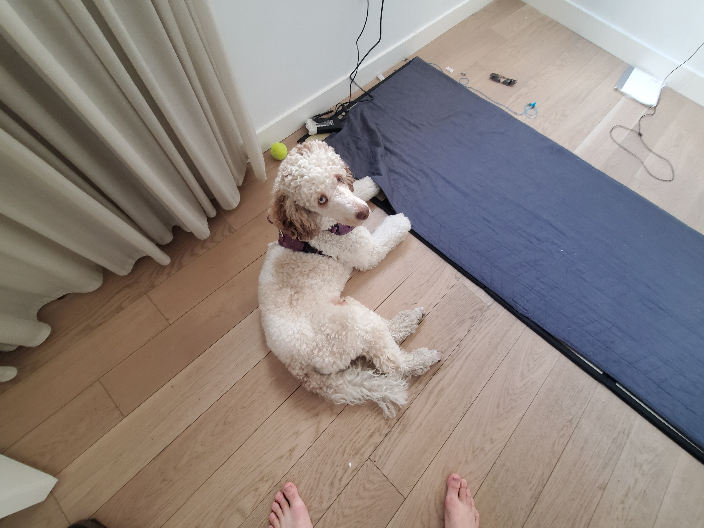
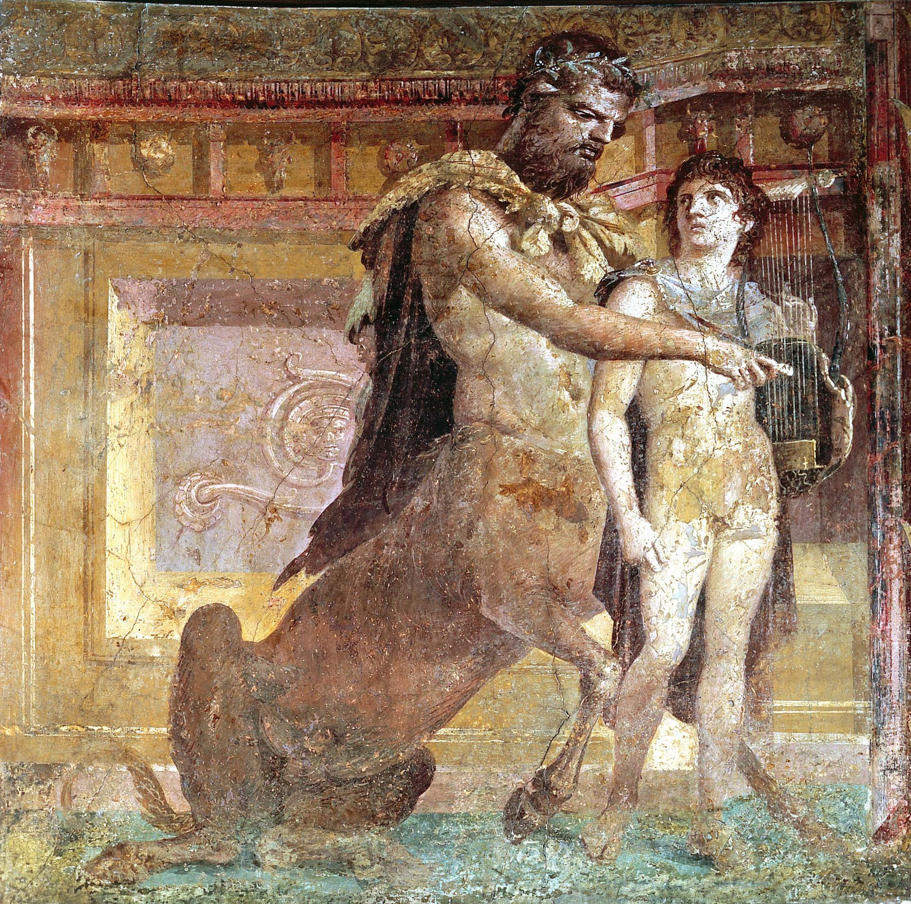

# Chiron

A robotic companion for my poodle Zeus. 

## Problem

I have a lot of projects I want to work on intensely. However, when I work on my projects for long periods of time, my poodle gets bored and sleeps at my feet. I didn't adopt a poodle for it to be a bored floor potato. I adopted it so it would be a lively, intelligent, active, and propserous life form, maybe even having lively pups of his own. I need a robot that will play with and teach/train my dog while I do hard work on my other projects. 

## Inspiration for Chiron the Robot

"Chiron", in Greek Mythology, is the "wisest and justest of all the centaurs". According to legend, Chiron is the half-sibling of Zeus, being the offspring of Cronus (Zeus' father) and the water-nymph Philyra.

Chiron, being a half man, half beast with his youth-nurturing nature, is the perfect name for a robot that will be used to help me raise a young poodle well.

